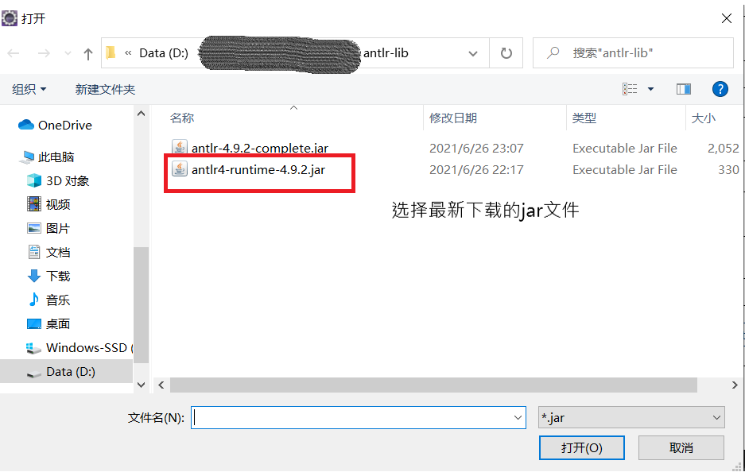

# 1 摘要
ANTLR (ANother Tool for Language Recognition) 是一个强大的解析器的生成器，可以用来读取、处理、执行或翻译结构化文本或二进制文件。他被广泛用来构建语言，工具和框架。ANTLR可以从语法上来生成一个可以构建和遍历解析树的解析器。

Hive和Spark中使用antlr来生成词法和语法的解析器。

ANTLR 语法识别一般分为二个阶段：

1. 词法分析阶段 （lexical analysis)

    对应的分析程序叫做 lexer ，负责将符号（token）分组成符号类（token class or token type）

2. 解析阶段

    根据词法，构建出一棵分析树（parse tree）或叫语法树（syntax tree）

解析过程如下图


ANTLR 的直观印象，就像是在走迷宫，或者说是电路板更准确，最终只有一条最优路可通达开始与结束，中间的各种叉路与开关，就是我们所编写的规则，下面是一个SQL查询的简单实现，截取一部分图示：


# 2 安装ANTLR
ANTLR是由Java写成的，所以在安装ANTLR前必须保证已经安装有JDK 1.7或以上版本。
http://www.antlr.org/download.html 下载ANTLR的最新版本

### 1 下载antlr-4.9.2-complete.jar文件 
http://www.antlr.org/download/antlr-4.9.2-complete.jar

### 2 设置classpath
Add antlr-4.9.2-complete.jar to CLASSPATH

### 3 创建bat文件

1. 创建antlr4.bat
    ```shell
    java org.antlr.v4.Tool %*
    # 或者
    # java -jar antlr-4.9.2-complete.jar  # 启动org.antlr.v4.Tool
    ```
2. grun.bat
    ```shell
   @ECHO OFF
    SET TEST_CURRENT_DIR=%CLASSPATH:.;=%
    if "%TEST_CURRENT_DIR%" == "%CLASSPATH%" ( SET CLASSPATH=.;%CLASSPATH% )
    @ECHO ON
    java org.antlr.v4.gui.TestRig %*
    ```
### 4 测试下ANTLR工具是否工作正常

```
antlr4  # 启动org.antlr.v4.Tool
```

如果正常的话会看到以下帮助信息：

```
ANTLR Parser Generator  Version 4.9.2
 -o ___              specify output directory where all output is generated
 -lib ___            specify location of grammars, tokens files
 ...

```

antlr-4.9.2-complete.jar包含运行ANTLR工具的所有必要依赖，以及编译和执行由ANTLR生成的识别器所需的运行库。

1. ANTLR工具会将.g4语法文件描述的语法生成java文件。
   
2. 用javac来编译生成的java文件，执行XXXParser.class来解析识别输入的语法语句生成语法树。该jar包还包含两个支持库：TreeLayout（一个复杂的树布局库）和StringTemplate（一个用于生成代码和其它结构化文本的模板引擎）。


ANTLR语法文件的github
https://github.com/antlr/grammars-v4

# 3 安装eclipse 插件

为了开发方便我们还可以安装eclipse插件

* antlr4 ide for Eclipse
    从Eclipse Marketplace安装antlr4 ide
    
    
    安装完插件后重启eclipse就行了

    安装完插件后会默认的install了一个antlr-4.4-complete.jar文件
    可以如下设置换成下载的最新的antlr-4.9.2-complete.jar文件
    
    

* AntlrDT Tools Suite for Eclipse

# 4 一个简单的hello例子

### 1. 用eclipse创建一个antlr4 project


创建antlr4 project完成后会自动生成一个Hello.g4文件


安装完插件后会有
* syntax diagram视图
  会将语法解析成一个语法图，可以一边修改语法文件一边确认
* ParserTree视图
  会将输入的语句解析成一个语法树

### 2. 根据.g4文件生成java文件
右键hello.g4文件 点击generate


在console会打印成功信息
```
ANTLR Tool v4.9.2 (D:\work\github\java\antlr-lib\antlr-4.9.2-complete.jar)
Hello.g4 -o D:\Users\hui\eclipse-workspace\AntlrHello\target\generated-sources\antlr4 -listener -no-visitor -encoding UTF-8

BUILD SUCCESSFUL
Total time: 452 millisecond(s)
```
会生成如下文件


### 3. 也可以通过命令行来生成java文件

进入到Hello.g文件所在的目录执行如下命令也会生成java文件
```
antlr4 Hello.g
```
编译java文件
```
javac *.java
```

### 4. 通过grun执行HelloParser来解析语句

1. 输出tree字符
``` shell
grun Hello r -tree # 这个r是hello.g4语法文件的语法识别符，这个指定错了会解析错误
# 输入要解析的语句
hello world
# 然后按ctrl+z
^Z
(输出:)
(r hello world)
```
2. 输出token
``` shell
grun Hello r -tokens # 这个r是hello.g4语法文件的语法识别符，这个指定错了会解析错误
# 输入要解析的语句
hello world
# 然后按ctrl+z
^Z
(输出:)
[@0,0:4='hello',<'hello'>,1:0]
[@1,6:10='world',<ID>,1:6]
[@2,13:12='<EOF>',<EOF>,2:0]
```
3. 输出gui 语法树
``` shell
grun Hello r -gui # 这个r是hello.g4语法文件的语法识别符，这个指定错了会解析错误
# 输入要解析的语句
hello world
# 然后按ctrl+z
^Z
```
输出如下图


### 3. 写一个listener模式java文件来遍历语法树

antlr会生成一个HelloBaseListener.java文件，我们只要继承于HelloBaseListener类并重写想要遍历的函数

``` java
public class MyHelloListener extends HelloBaseListener {

	@Override
	public void enterR(HelloParser.RContext ctx) {
		// 获取整个语句
		System.out.format("getText:%s\n", ctx.getText());
		// 获取子节点个数
		System.out.format("getChildCount:%s\n", ctx.getChildCount());
		// 获取ID的内容
		System.out.format("ID().getText():%s\n", ctx.ID().getText());
		// 获取start token内容
		System.out.format("start token:%s\n", ctx.start.getText());
		// 获取start token index
		System.out.format("start token index:%s\n", ctx.start.getTokenIndex());
		// 获取start token type
		System.out.format("start token type:%s\n", ctx.start.getType());
		// 获取stop token index
		System.out.format("stop token index:%s\n", ctx.start.getStopIndex());
		// 获取stop token text
		System.out.format("stop token:%s\n", ctx.stop.getText());
		// 获取stop token index
		System.out.format("stop token index:%s\n", ctx.stop.getTokenIndex());
		// 获取type=1,index=0 token
		System.out.format("token 1,0:%s\n", ctx.getToken(1, 0).getText());
	}
	
	@Override
	public void exitR(HelloParser.RContext ctx) { 
		System.out.println("exitR");
	}
	
	public static void main(String[] args) {
		
		String str = "hello abc\t\r\n";
		
		CodePointCharStream input = CharStreams.fromString(str);

		HelloLexer lexer = new HelloLexer(input);

		// Get a list of matched tokens
		CommonTokenStream tokens = new CommonTokenStream(lexer);

		// Pass the tokens to the parser
		HelloParser parser = new HelloParser(tokens);
		
		ParseTree tree = parser.r();

		System.out.println(tree.toStringTree(parser));
		 // 创建一个能触发回调函数的语法分析树遍历器
        ParseTreeWalker parseTreeWalker = new ParseTreeWalker();
        // 将监听器和语法树传入walk方法，该方法会遍历语法树触发回调
        parseTreeWalker.walk(new MyHelloListener(), tree);
		
	}
	
}
```

输出结果
```
(r hello abc)
getText:helloabc
getChildCount:2
ID().getText():abc
start token:hello
start token index:0
start token type:1
stop token index:4
stop token:abc
stop token index:1
token 1,0:hello
exitR
```

### 3. 写一个访问者(Visitor)模式java文件来遍历语法树

antlr会生成一个HelloBaseVisitor.java文件，我们只要继承于antlr会生成一个HelloBaseVisitor类并重写想要遍历的函数
按道理只需重写HelloBaseVisitor类的visitR方法，不知道为什么，并没有调用这个方法，后来又重写了visitChildren，才被调用了。


``` java
public class MyHelloVisitor extends HelloBaseVisitor<String > {
	
	@Override
	public String visitR(HelloParser.RContext ctx) { 
		visitId(ctx.ID());
		System.out.format("r.h;%s\n", ctx.getChild(0).getText());
		return ctx.getChild(0).getText();
	}
	
	public String visitId(TerminalNode id) { 
		System.out.format("r.id;%s\n", id.getText());
		return id.getText();
	}
	
	@Override
	public String visitChildren(RuleNode node) {
		for(int i=0;i<node.getChildCount();i++) {
			ParseTree item = node.getChild(i);
			if(item.getChildCount()>0) {
				item.accept(this);
			} else {
				System.out.println(item.getText());
			}
		}
		
		return node.getText();
	}
	
	public static void main(String[] args) {
		String str = "hello abc\t\r\n";
		
		CodePointCharStream input = CharStreams.fromString(str);

		HelloLexer lexer = new HelloLexer(input);

		// Get a list of matched tokens
		CommonTokenStream tokens = new CommonTokenStream(lexer);

		// Pass the tokens to the parser
		HelloParser parser = new HelloParser(tokens);
		
		ParseTree tree = parser.r();

		System.out.println(tree.toStringTree(parser));
		
		MyHelloVisitor v = new MyHelloVisitor();
		v.visit(tree);
	
		
	}
}
```
输出结果
```
(r hello abc)
hello
abc
```

# 参考文档

ANTLR 4简明教程
https://www.cntofu.com/book/115/readme.html

https://so.csdn.net/so/search?q=antlr&t=blog&u=SHU15121856

https://blog.csdn.net/baichoufei90/article/details/82793456

https://blog.csdn.net/yuexiang321/article/details/52770283

https://blog.csdn.net/umier2000/category_8335663.html?spm=1001.2014.3001.5482

https://blog.csdn.net/umier2000/article/details/84095467

other
https://blog.csdn.net/wjy320

官方文档
https://github.com/antlr/antlr4/blob/master/doc/getting-started.md

https://github.com/antlr/antlr4/blob/master/doc/index.md

官方网站
https://www.antlr.org/tools.html

各种语法文件（java，sql）
https://github.com/antlr/grammars-v4
